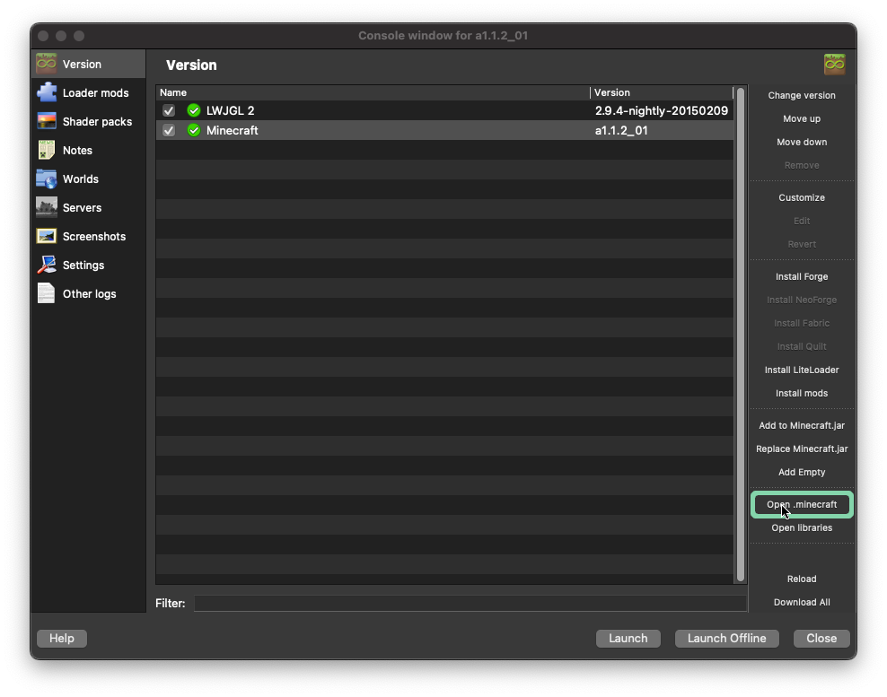
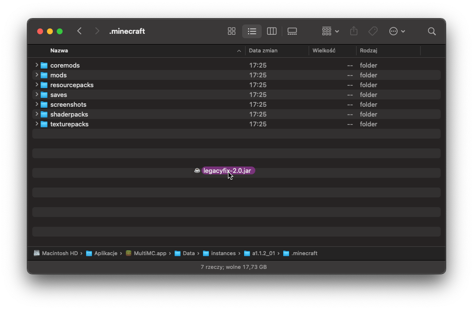
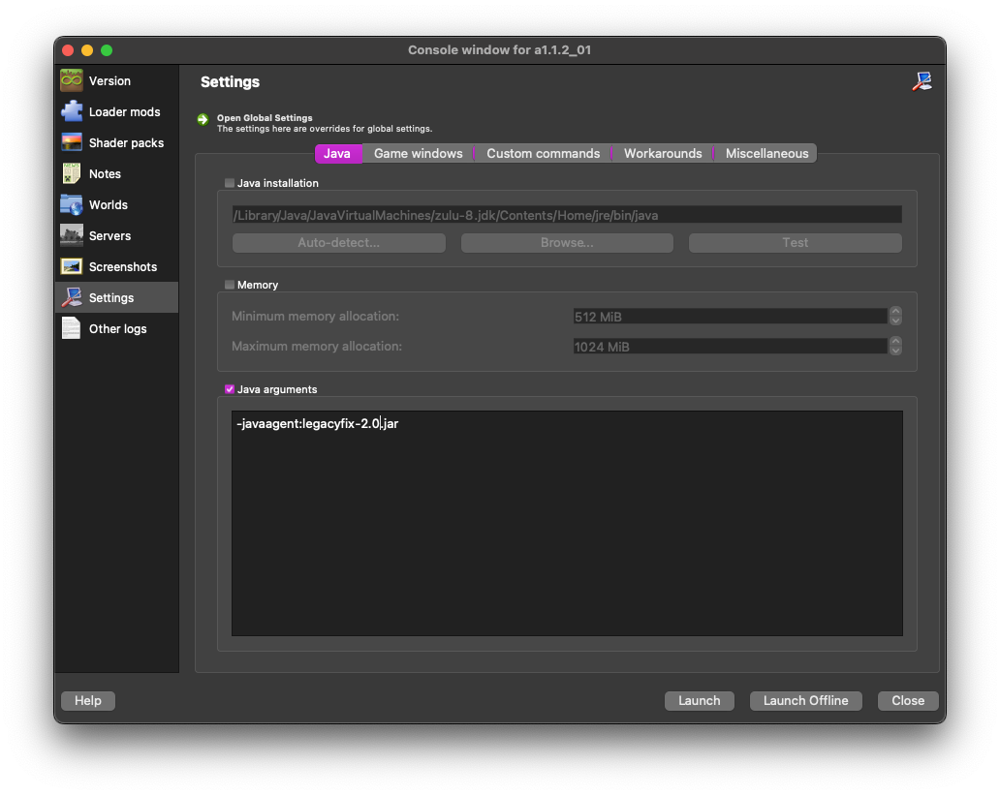
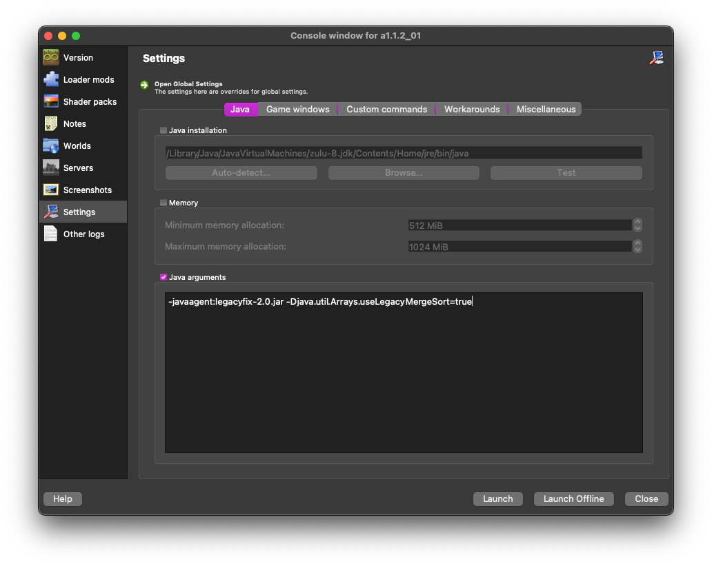

# Using LegacyFix with MultiMC
## Grab the latest artifact from GitHub Action
Head over to the [Actions tab](https://github.com/betacraftuk/legacyfix/actions/workflows/gradle.yml) and click on the latest run (at the top). 
Then, scroll down to the **Artifacts** section and download the `artifact.zip` file, 
in it should be a file called `legacyfix-2.0.jar`.

Note: Downloading artifacts requires a GitHub account, though you can use [nightly.link](https://nightly.link/) to download the latest build without one.

## Add LegacyFix to MultiMC
Create a new instance or edit an existing one, then go to the **Version** tab. 
On the sidebar, click  **Open .minecraft** button:

And move the `legacyfix-2.0.jar` file you downloaded earlier into the instance directory:

Next, go to the **Settings** tab. 
Enable **Java arguments**, and add `-javaagent:legacyfix-2.0.jar` to it:

Additionally add `-Djava.util.Arrays.useLegacyMergeSort=true` if you want to play versions before Beta 1.6:

And it's done! You're ready to play Minecraft with LegacyFix.