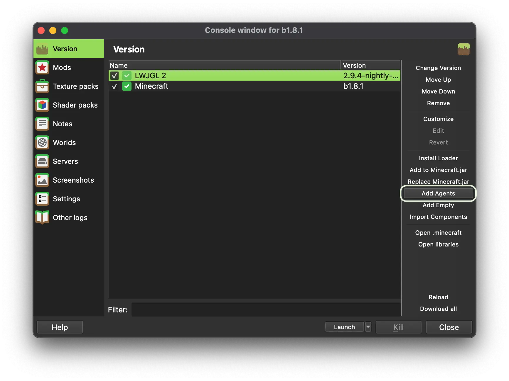
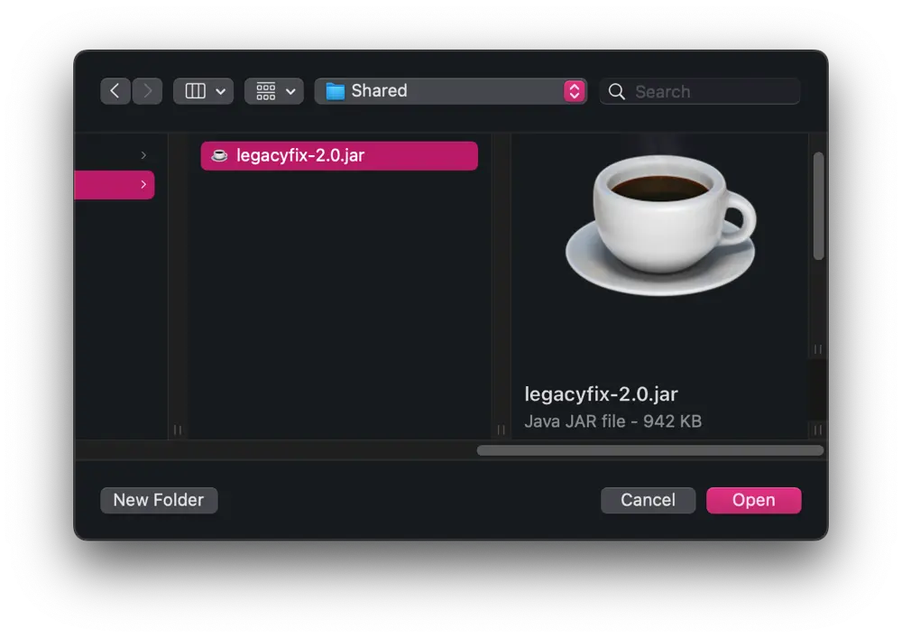
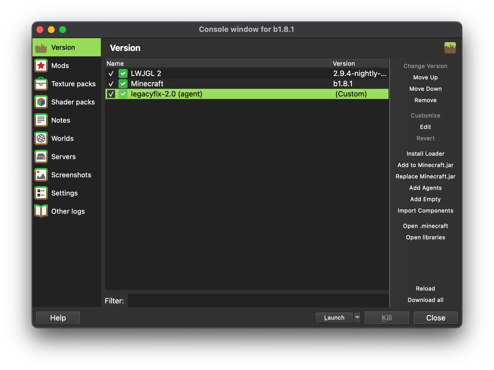

# Using LegacyFix with Prism Launcher
## Grab the latest artifact from GitHub Action
Head over to the [Actions tab](https://github.com/betacraftuk/legacyfix/actions/workflows/gradle.yml) and click on the latest run (at the top). 
Then, scroll down to the **Artifacts** section and download the `artifact.zip` file, 
in it should be a file called `legacyfix-2.0.jar`.

Note: Downloading artifacts requires a GitHub account, though you can use [nightly.link](https://nightly.link/) to download the latest build without one.

## Add LegacyFix to Prism Launcher
> [!IMPORTANT]
> Make sure `Enable online fixes` is disabled in the instance settings, as LegacyFix does not work with it.
> 
> You can do this by editing the instance, go to `Settings` -> `Miscellaneous`, and then you will see a section called `Legacy settings`, and there you can turn off `Enable online fixes (experimental)`.

Create a new instance or edit an existing one, then go to the **Version** tab. 
On the sidebar, click the **Add Agents** button:

And point the launcher to the `legacyfix-2.0.jar` file you downloaded earlier:

A new entry should appear in the list:

And it's done! You're ready to play Minecraft with LegacyFix.
