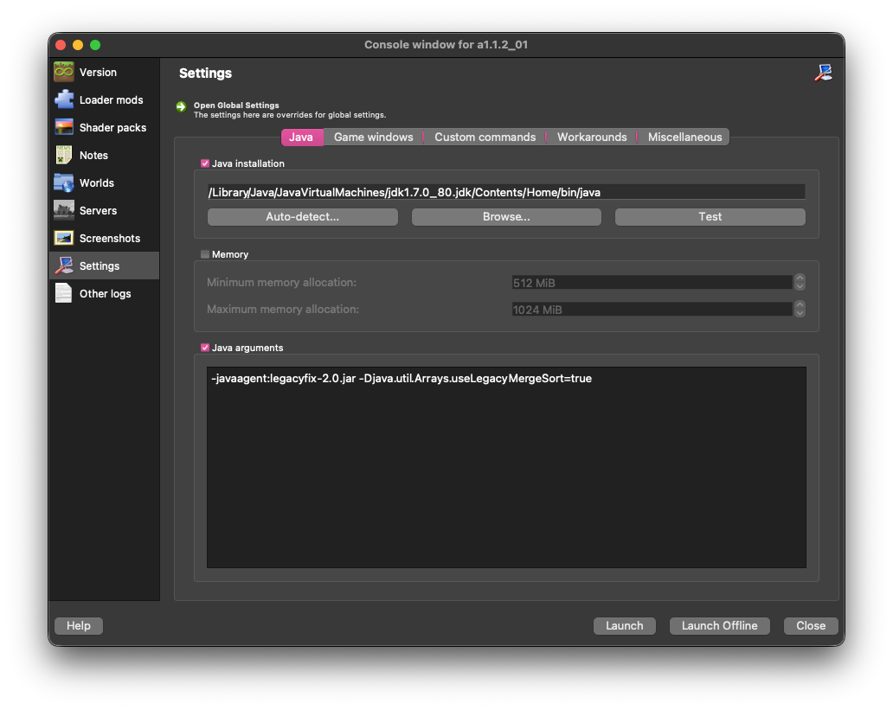
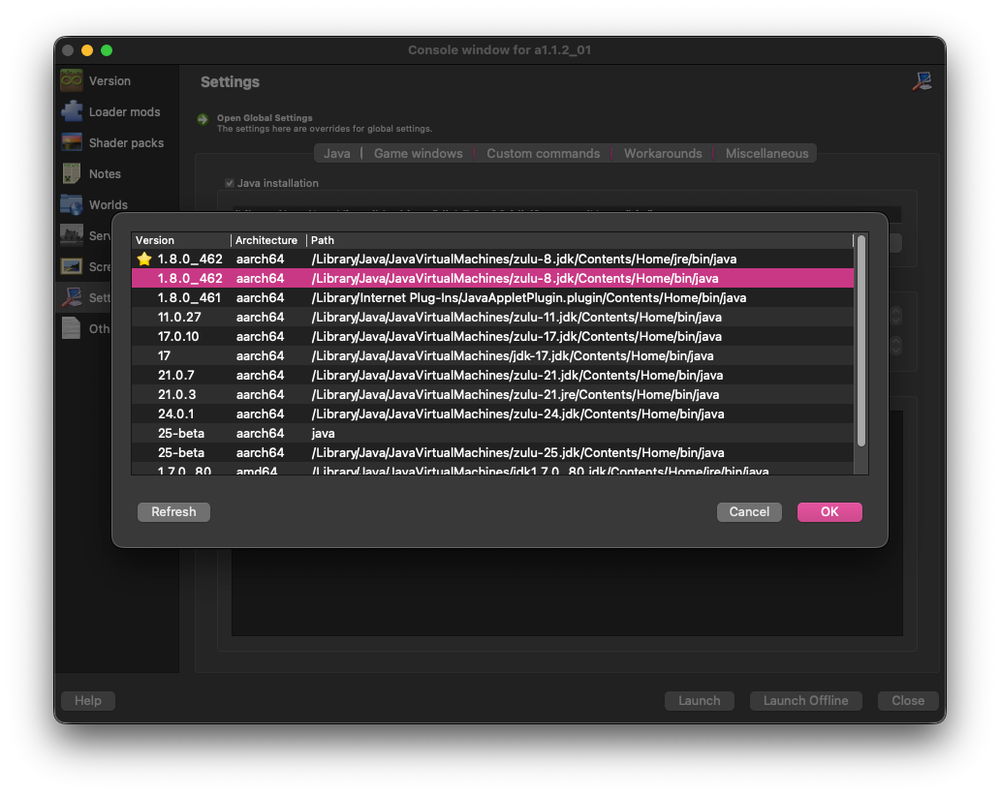

# Using LegacyFix with MultiMC
## Grab the latest artifact from GitHub Action
Head over to the [Actions tab](https://github.com/betacraftuk/legacyfix/actions/workflows/gradle.yml) and click on the latest run (at the top). 
Then, scroll down to the **Artifacts** section and download the `artifact.zip` file, 
in it should be a file called `legacyfix-2.0.jar`.

Note: Downloading artifacts requires a GitHub account, though you can use [nightly.link](https://nightly.link/) to download the latest build without one.
By clicking [here](https://nightly.link/betacraftuk/legacyfix/workflows/gradle/develop/artifact.zip) you can download the latest build via nightly.link.

## Add LegacyFix to MultiMC
Create a new instance or edit an existing one, then go to the **Version** tab. 
On the sidebar, click  **Open .minecraft** button:

And move the `legacyfix-2.0.jar` file you downloaded earlier into the instance directory:

Next, go to the **Settings** tab. 
Enable **Java arguments**, and add `-javaagent:legacyfix-2.0.jar` to it:

Additionally add `-Djava.util.Arrays.useLegacyMergeSort=true` if you want to play versions before Beta 1.6:

#### For LegacyFix to function properly, you should also make your instance use up-to-date Java.
If you're using Windows 10/11 with Intel HD Graphics, or you're using Windows XP/Vista, read [this document](Modern%20TLS%20on%20old%20Java.md).
 *Otherwise*, follow these steps to get a recent build of Java 8:

Download and install the latest Java 8 update from a vendor of your choice. We recommend Azul Java which you can get [here](https://www.azul.com/downloads/?version=java-8-lts&package=jre#zulu). Make sure to get the right installer for your architecture, 90% of you would probably want to get a `x86 64-bit` build of Java.

Once you've installed it, open up MultiMC, edit your instance, go to the **Settings** tab, and then select the "Java installation" checkbox:

Next, click the **Auto-detect** button and click the **Refresh** button:

Now select the Java installation you've just installed and click **OK**.

And it's done! You're ready to play Minecraft with LegacyFix.