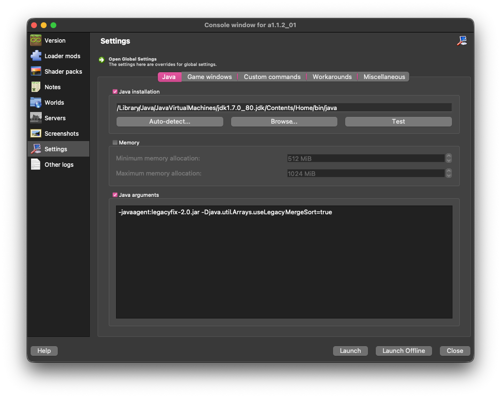
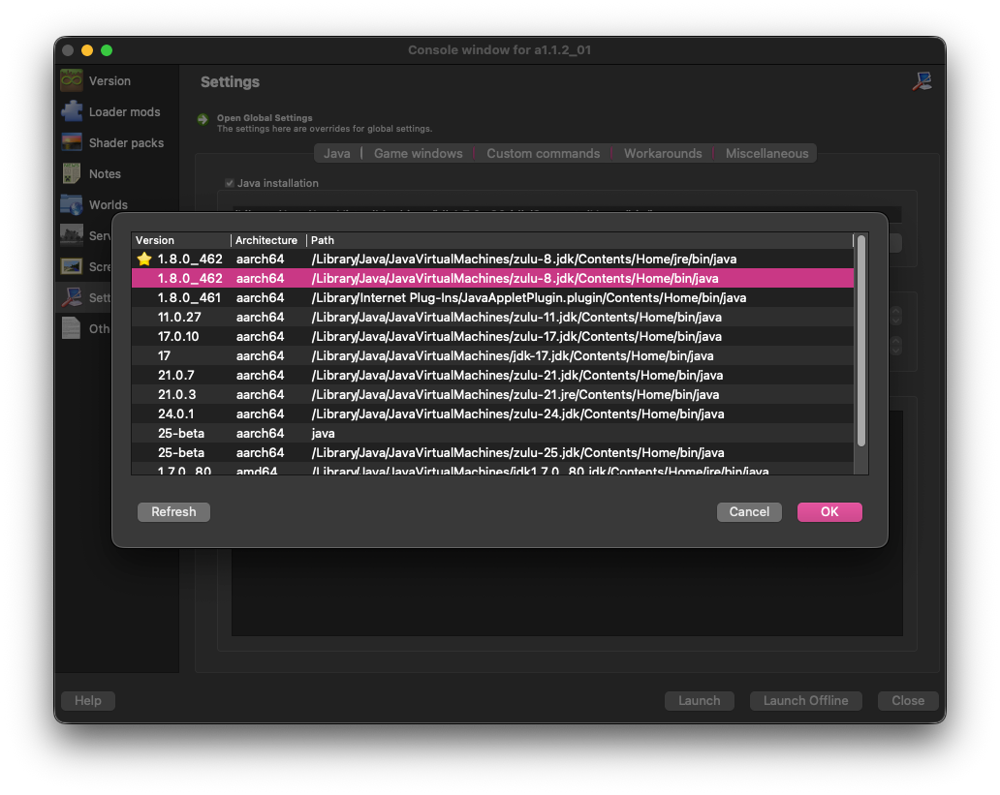
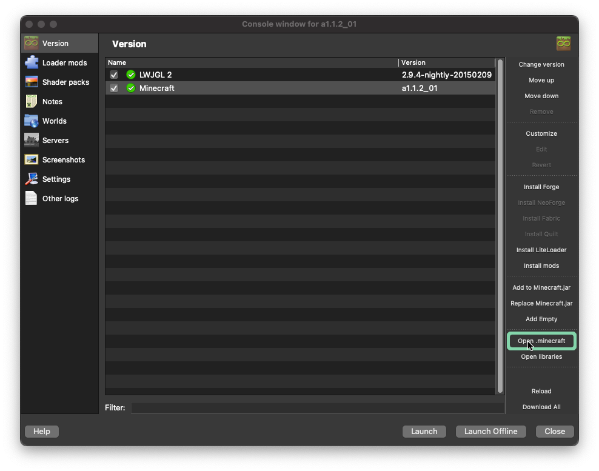
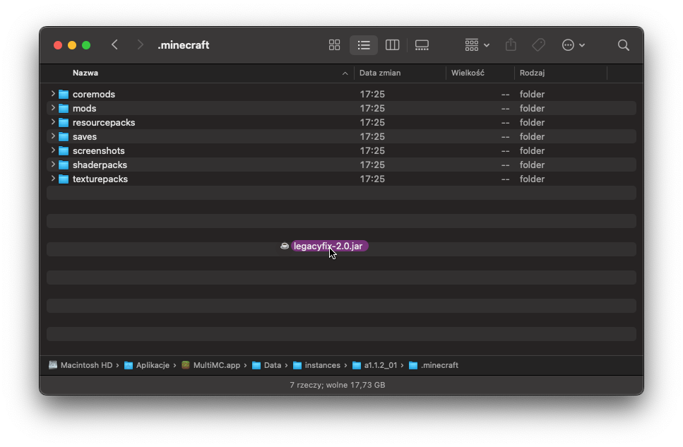
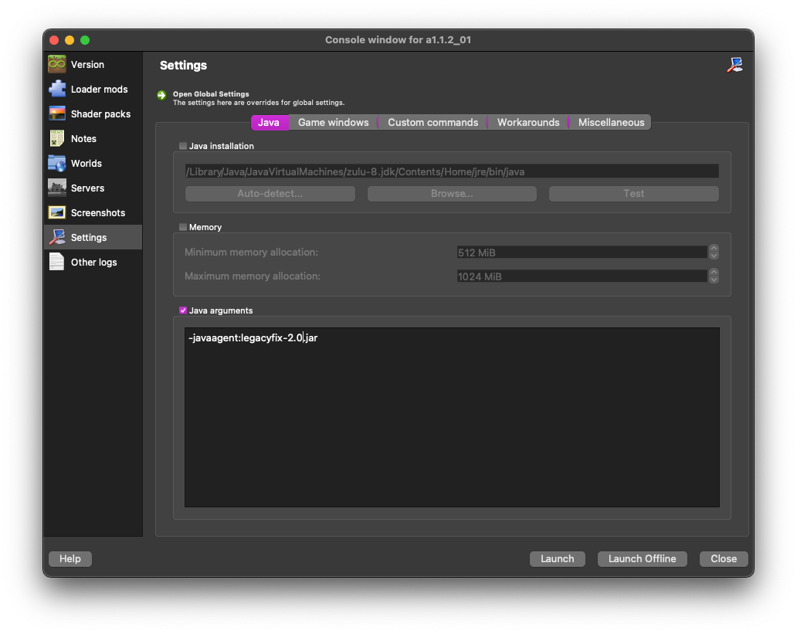

# Using LegacyFix with MultiMC
## 1. Download the latest release from GitHub
Head over to the [latest release](https://github.com/betacraftuk/legacyfix/releases/latest) of LegacyFix and download its jar. 

## 2. Update Java for your instance
> [!IMPORTANT]
> Following this step is **required** for LegacyFix to work properly.

If you're using Windows 10/11 with Intel HD Graphics, or you're using Windows XP/Vista, read [this document](Modern%20TLS%20on%20old%20Java.md).
 *Otherwise*, follow these steps to get a recent build of Java 8:

Download and install the latest Java 8 update from a vendor of your choice. We recommend Azul Java which you can get [here](https://www.azul.com/downloads/?version=java-8-lts&package=jre#zulu). Make sure to get the right installer for your architecture, 90% of you would probably want to get a `x86 64-bit` build of Java.

Once you've installed it, open up MultiMC, edit your instance, go to the **Settings** tab, and then select the "Java installation" checkbox:

Next, click the **Auto-detect** button and click the **Refresh** button:

Now select the Java installation you've just installed and click **OK**.

## 3. Apply LegacyFix to your MultiMC instance
Create a new instance or edit an existing one, then go to the **Version** tab. 
On the sidebar, click  **Open .minecraft** button:

And move the `legacyfix-[version].jar` file you downloaded earlier into the instance directory:

Next, go to the **Settings** tab. 
Enable **Java arguments**, and add `-javaagent:legacyfix-[version].jar` to it:

Now click the `Launch` button to launch the instance, and wait for this message to appear:

Close the message, and click the `Launch` button again.
### *And it's done!* You're now ready to play Minecraft with LegacyFix.
 

**Note:** The above message about installing LegacyFix might appear again in the future if you change the Minecraft version of the instance, or edit/revert component json of Minecraft or LWJGL. If you want to prevent LegacyFix from overwriting your intentional changes to `net.minecraft.json` or `org.lwjgl.json`, open the [Additional Settings](Additional%20settings.md) doc at ***Disable patching `net.minecraft.json`/`org.lwjgl.json` when using Prism/MultiMC***.
