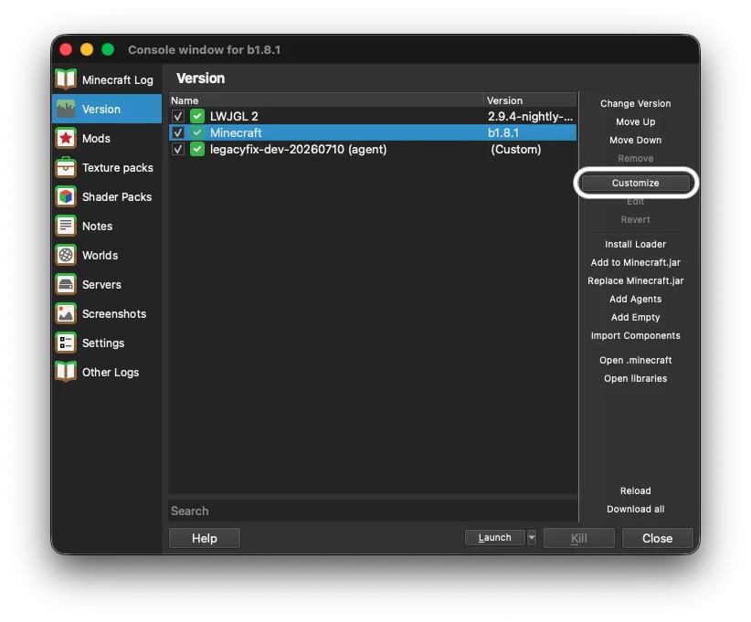
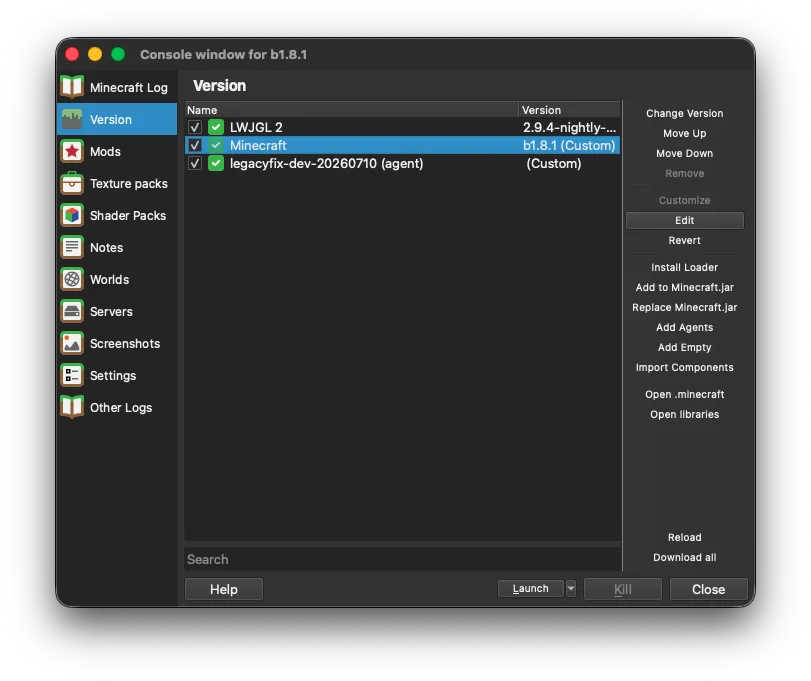
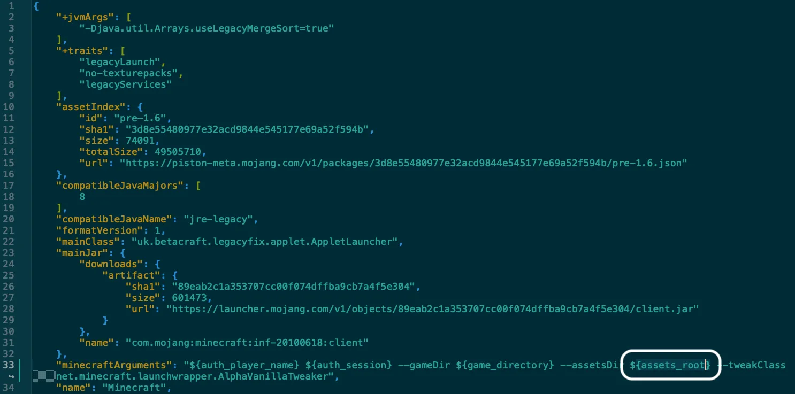
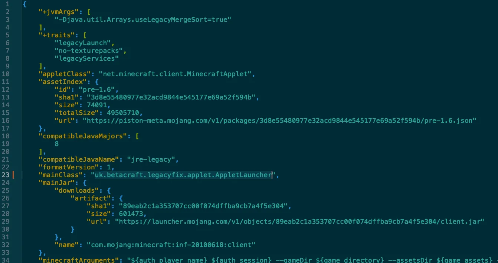
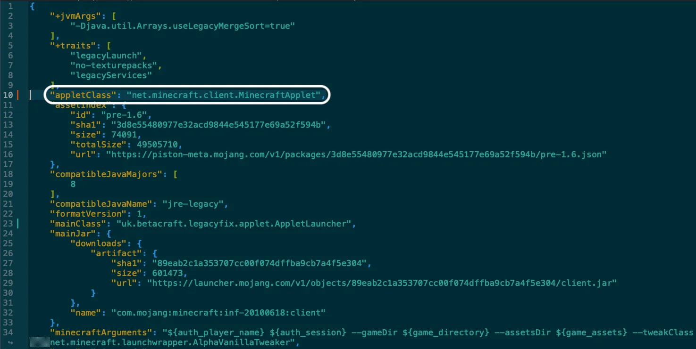
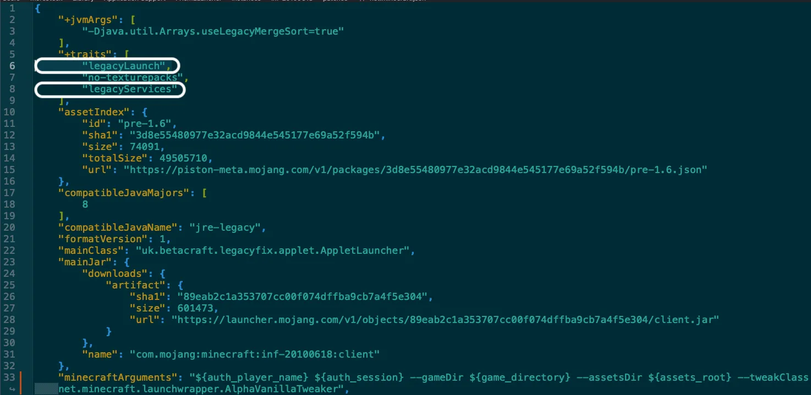
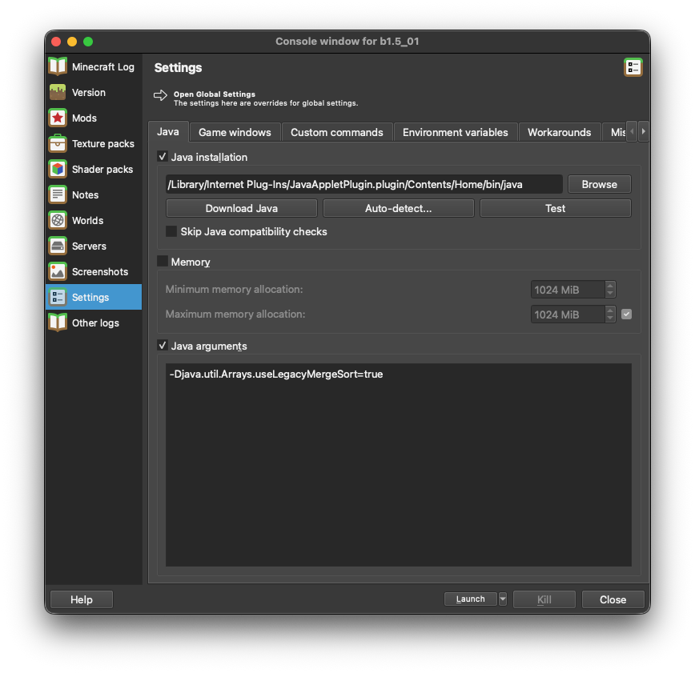
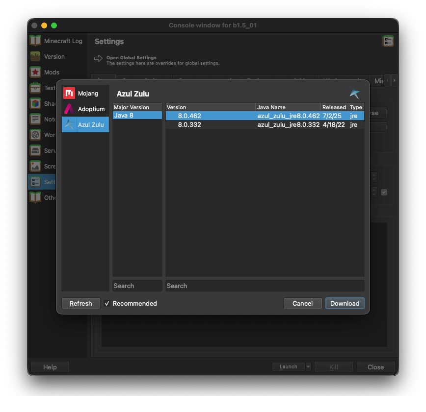
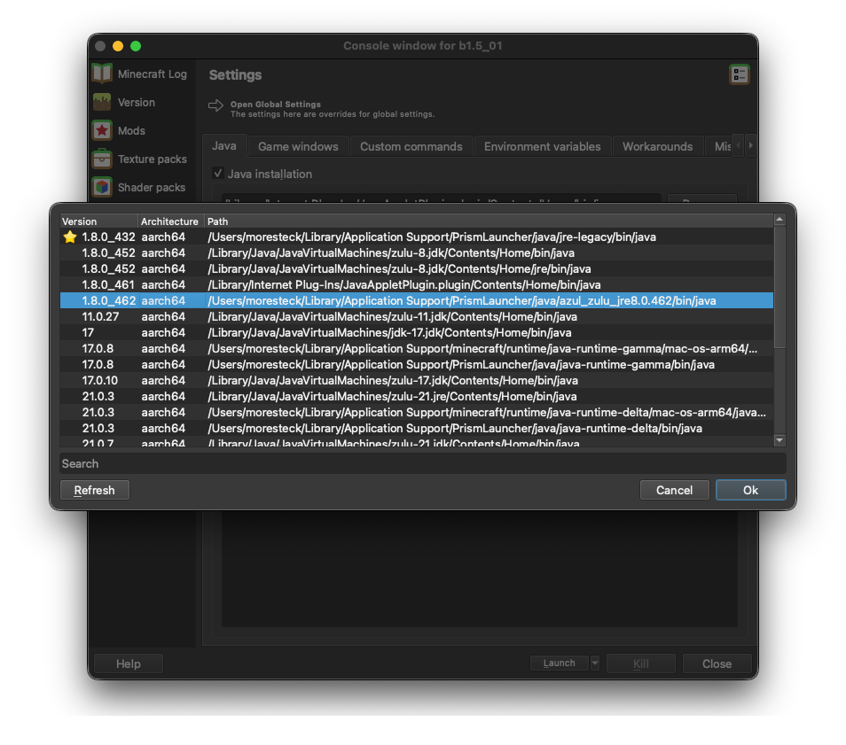

# Using LegacyFix with Prism Launcher
## Download the latest release from GitHub
Head over to the [latest release](https://github.com/betacraftuk/legacyfix/releases/latest) of LegacyFix and download its jar.<br>

## Add LegacyFix to Prism Launcher
> [!IMPORTANT]
> Make sure `Enable online fixes` is disabled in instance settings *and* global settings, as LegacyFix does not work with it.
>
> You can do this by editing the instance, go to `Settings` -> `Tweaks`, and under section called `Legacy Tweaks`, turn off `Enable online fixes (experimental)`.
> For Global settings, go to `Settings` -> `Minecraft` -> `Tweaks`, and under section `Legacy Tweaks` turn off `Enable online fixes (experimental)`.

Create a new instance or edit an existing one, then go to the **Version** tab.<br>
On the sidebar, click the **Add Agents** button:

And point the launcher to the `legacyfix` jar file you downloaded earlier:

A new entry should appear in the list:

Next, select the ***Minecraft*** component, click the **Customize** button, and follow that by clicking the **Edit** button:



The json of the Minecraft component should now open in your default text editor.<br>
Search for `${game_assets}` inside the `minecraftArguments` property. If it's present, replace it with `${assets_root}`.


Now, if your Minecraft version is <ins>a1.0.6 or newer</ins>, you can scroll down to the [Update Java section](#update-java).<br>
Locate the `"mainClass"` property. Change its value to:
```
uk.betacraft.legacyfix.applet.AppletLauncher
```


Try to find an `"appletClass"` property. If it exists - get rid of it by removing the whole line it's located at. If it doesn't exist, you don't have to worry about it.


Next, locate the `"+traits"` list and remove the lines `"legacyLaunch"` and `"legacyServices"` from it.


Save the file and close your text editor.


### Update Java
### ⚠️ For LegacyFix to function properly, you should also make your instance use up-to-date Java.
Prism Launcher defaults to outdated Java 8u51 (from July 2015) on Windows, 8u202 (from January 2019) on Linux, and 8u74 (from February 2016) on Intel macOS.
<br>If you're using Windows 10/11 with Intel HD Graphics and <ins>*you know*</ins> that you need to be using Java 8u51 for Minecraft to run, read [this document](Modern%20TLS%20on%20old%20Java.md).
<br>Otherwise, follow these steps to get a recent build of Java 8:

Edit your instance, go to the **Settings** tab, then `Java` tab, then select the "Java Installation" checkbox:


Next, click on the **Open Java Downloader** button, pick Adoptium or Azul Zulu (we recommend Azul Zulu), and select the most recent release of Java 8:



Then click on **Download** and wait for it to finish.

Next, click the **Detect** button and select the Java installation you've just downloaded and click **Ok**:


And it's done! You're ready to play Minecraft with LegacyFix.
