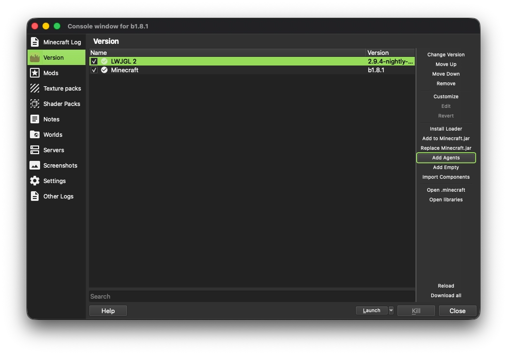
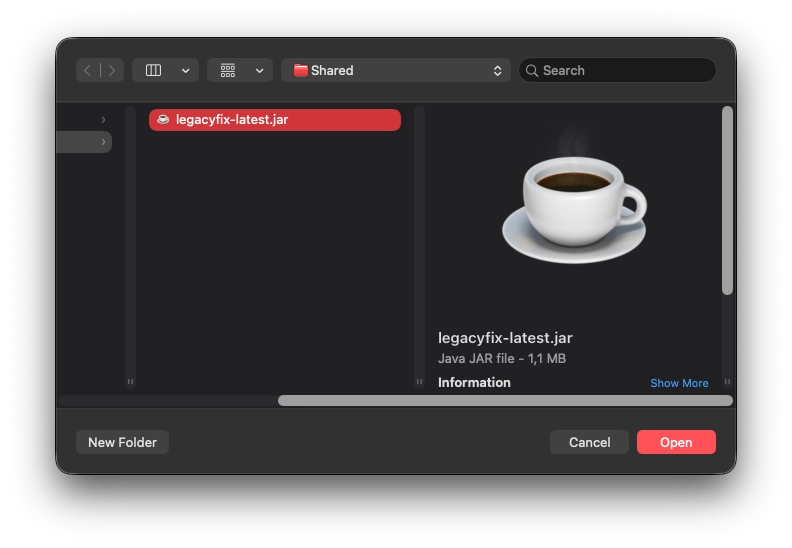
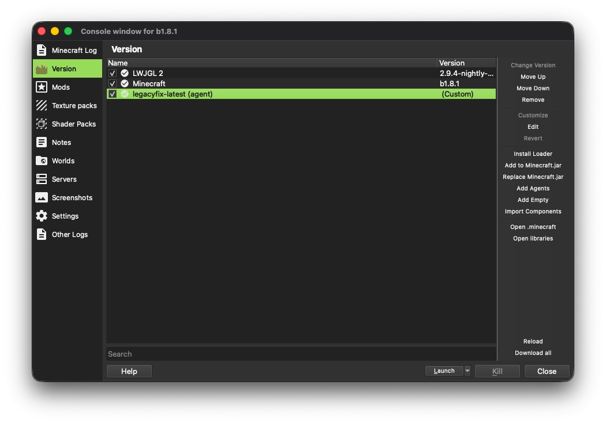
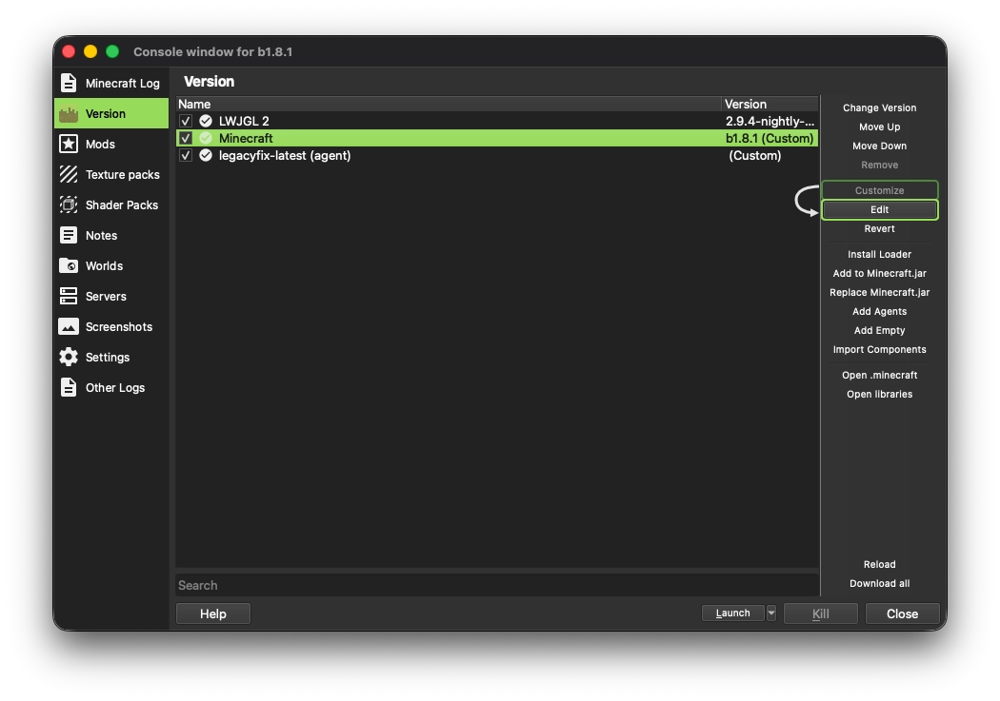
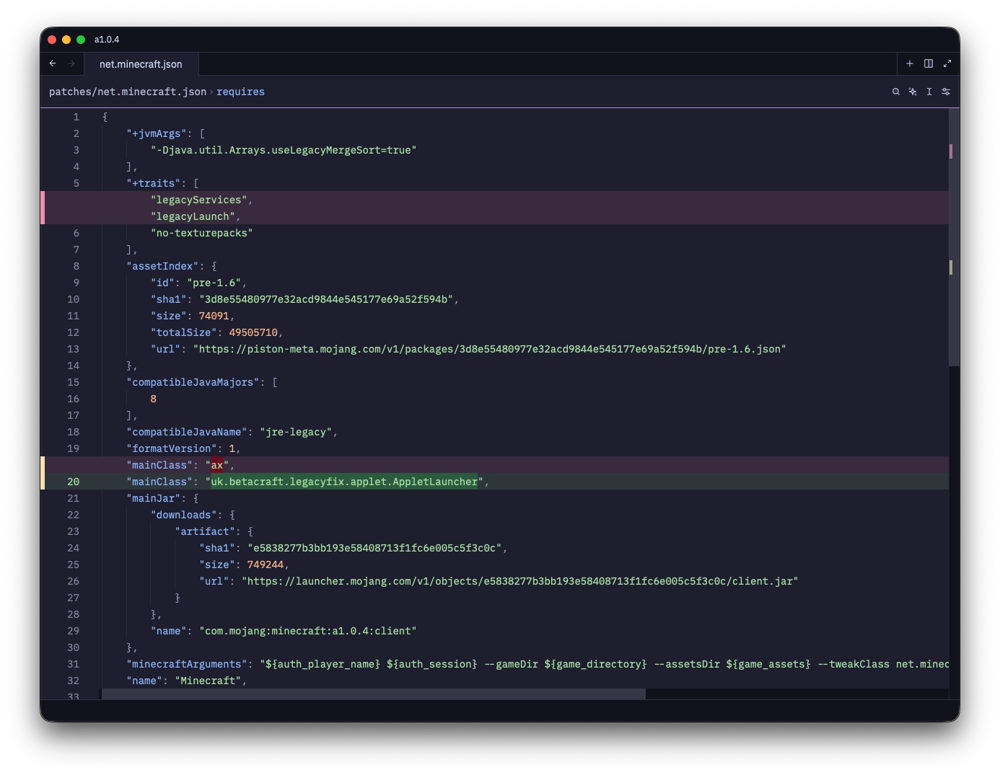
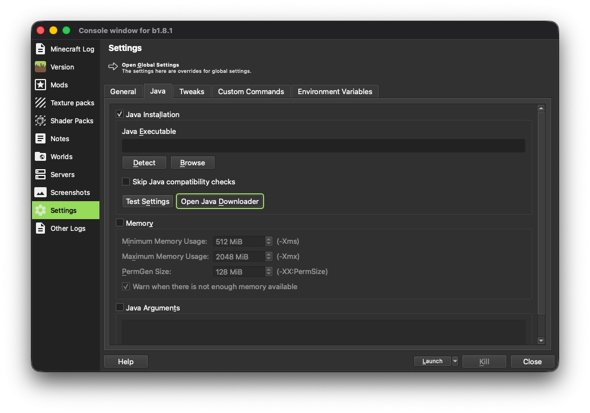
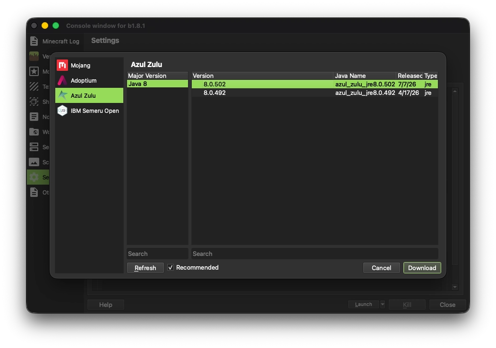
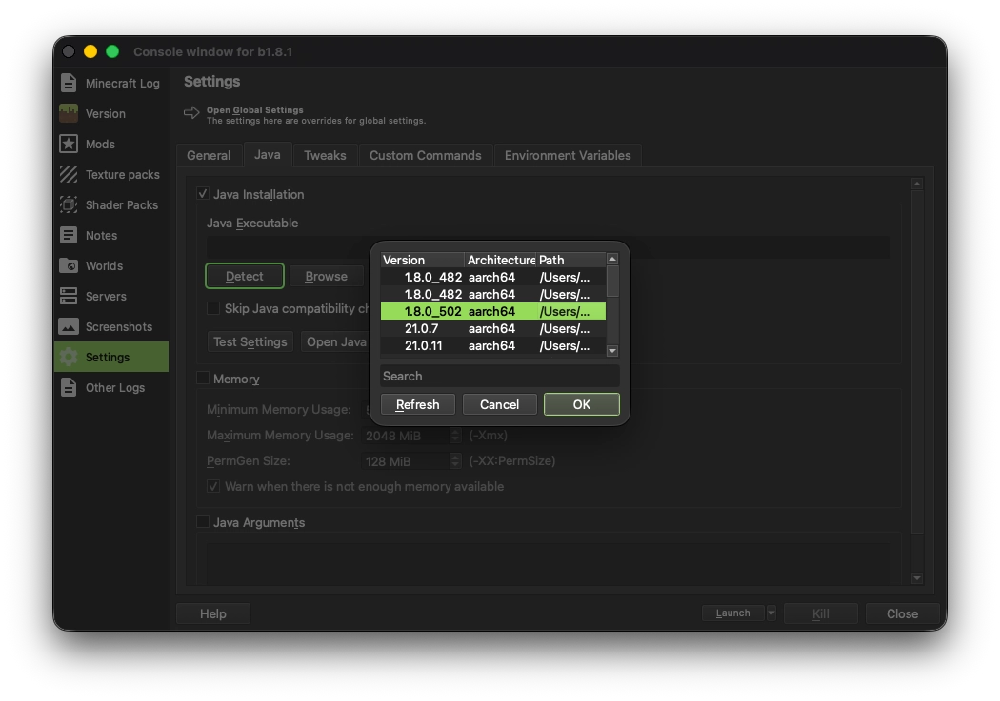

# Using LegacyFix with Prism Launcher

## Download the latest release from GitHub
Head over to the [latest release](https://github.com/betacraftuk/legacyfix/releases/latest) of LegacyFix and download the jar.

## Add LegacyFix to Prism Launcher
> [!IMPORTANT]
> Make sure `Enable online fixes` is disabled in instance settings *and* global settings, as LegacyFix does not work with it.
>
> To do this, edit the instance, go to `Settings` > `Tweaks`, and under `Legacy Tweaks`, turn off `Enable online fixes (experimental)`.
>
> For Global settings, go to `Settings` > `Minecraft` > `Tweaks`, and under `Legacy Tweaks` turn off `Enable online fixes (experimental)`.

Create a new instance or edit an existing one, then go to the **Version** tab.<br>
On the sidebar, click the **Add Agents** button:


And point the launcher to the jar file downloaded earlier:


A new entry should appear in the list:


> [!IMPORTANT]
> The following is needed only for versions **<ins>older than a1.0.6</ins>**.
>
> **Skip to the [Update Java](#update-java) section for a1.0.6 or newer**.

---

Select the **Minecraft** component, click the **Customize** button, followed by **Edit**:


The JSON of the Minecraft component should now open in your default text editor.

Find the `+traits` list and remove `legacyServices` and `legacyLaunch` from it.<br>
Then, locate the `"mainClass"` property and change the value to:
```
uk.betacraft.legacyfix.applet.AppletLauncher
```



Save the file and close your text editor.

### Update Java
> [!IMPORTANT]
> This is **required** for LegacyFix to work properly.

Prism Launcher defaults to outdated Java 8u51 (from July 2015) on Windows, 8u202 (from January 2019) on Linux, and 8u74 (from February 2016) on Intel macOS. 
If you're using Windows 10/11 with Intel HD Graphics and <ins>*you know*</ins> that you need to be using Java 8u51 for Minecraft to run, read [this document](Modern%20TLS%20on%20old%20Java.md). Otherwise, follow these steps to get a recent build of Java 8:

Edit your instance, go to the **Settings** tab, then `Java` tab, then select the "Java Installation" checkbox.
Click on the **Open Java Downloader** button.



Pick Azul Zulu (recommended) or Adoptium, and select the most recent release of Java 8:



Click on **Download** and wait for it to finish.

Next, click the **Detect** button and select the Java installation you've just downloaded and click **Ok**:


Done! You're ready to play Minecraft with LegacyFix.
