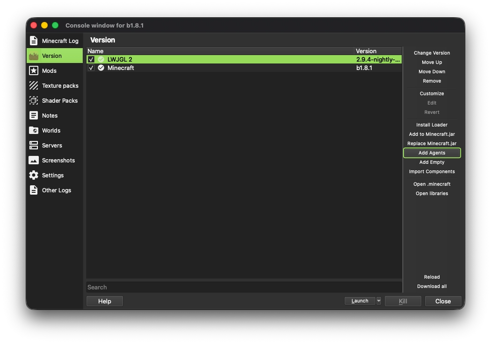
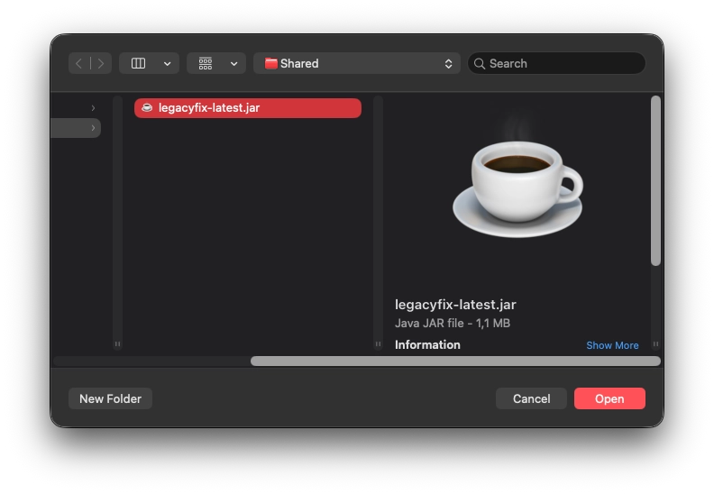
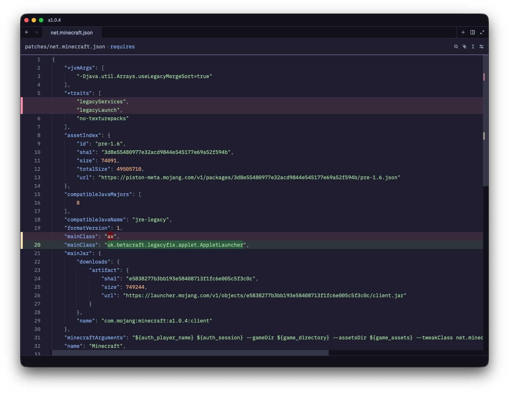
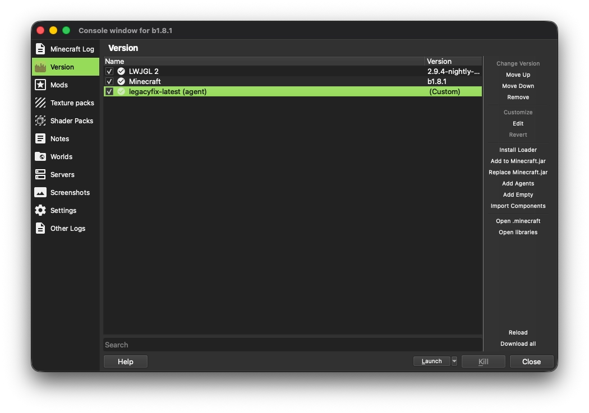
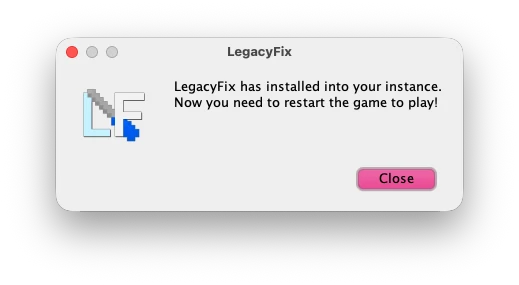

# Using LegacyFix in Prism Launcher

## 1. Download the latest release from GitHub
Head over to the [latest release](https://github.com/betacraftuk/legacyfix/releases/latest) of LegacyFix and download the jar.

## 2. Update Java for your instance
> [!IMPORTANT]
> This is **required** for LegacyFix to work properly.

Prism Launcher defaults to outdated Java 8u51 (from July 2015) on Windows, 8u202 (from January 2019) on Linux, and 8u74 (from February 2016) on Intel macOS. 
If you're using Windows 10/11 with Intel HD Graphics and <ins>*you know*</ins> that you need to be using Java 8u51 for Minecraft to run, read [this document](Modern%20TLS%20on%20old%20Java.md). Otherwise, follow these steps to get a recent build of Java 8:

Edit your instance, go to the **Settings** tab, then `Java` tab, then select the "Java Installation" checkbox.
Click on the **Open Java Downloader** button.

Pick Azul Zulu (recommended) or Adoptium, and select the most recent release of Java 8:

Click on **Download** and wait for it to finish.

Next, click the **Detect** button and select the Java installation you've just downloaded and click **Ok**:

## 3. Apply LegacyFix to your Prism instance
Click the `Edit` button for your instance, then go to the **Version** tab. 
On the sidebar, click the **Add Agents** button:

And point the launcher to the jar file downloaded earlier:

A new entry should appear in the list:

Now click the `Launch` button to launch the instance, and wait for this message to appear:

Close the message, and click the `Launch` button again.
### *And it's done!* You're now ready to play Minecraft with LegacyFix.
 

**Note:** The above message about installing LegacyFix might appear again in the future if you change the Minecraft version of the instance, or edit/revert component json of Minecraft or LWJGL. If you want to prevent LegacyFix from overwriting your intentional changes to `net.minecraft.json` or `org.lwjgl.json`, open the [Additional Settings](Additional%20settings.md) doc at ***Disable patching `net.minecraft.json`/`org.lwjgl.json` when using Prism/MultiMC***.
